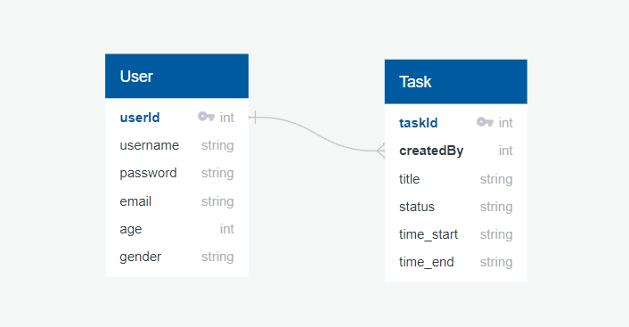

<br />
<div align="center">
  
  <h3 align="center">Task Management system</h3>
</div>

<details>
  <summary>Table of Contents</summary>
  <ol>
    <li>
      <a href="#about-the-project">About The Project</a>
      <ul>
        <li><a href="#built-with">Built With</a></li>
      </ul>
    </li>
    <li>
      <a href="#getting-started">Getting Started</a>
      <ul>
        <li><a href="#prerequisites">Prerequisites</a></li>
        <li><a href="#installation">Installation</a></li>
      </ul>
    </li>
    <li><a href="#usage">Usage</a></li>
    <li><a href="#contact">Contact</a></li>
  </ol>
</details>


<!-- ABOUT THE PROJECT -->
## About The Project


Task Management App is an innovative web application designed to streamline task management, time tracking, and reporting processes for individuals. With its intuitive interface, robust features, and powerful reporting system, it's the ultimate solution for maximizing productivity and ensuring efficient project management. This article explores the key functionalities of App and highlights its time tracking and reporting capabilities, including the integration of charts for visualizing data.


### Built With

List of all frameworks/libraries used to bootstrap the App.

* [![Bootstrap][Bootstrap.com]][Bootstrap-url]
* [![React][React.js]][React-url]
* [![Node.js][Node.com]](Node-url)


<!-- GETTING STARTED -->
## Getting Started

To get a local copy up and running follow these simple example steps.

### Prerequisites

* [Node](https://nodejs.org/en)
* [MongoDB](https://www.mongodb.com/)

### Installation


1. Clone the repo
   
   ```sh
   git clone https://github.com/SamyIsaac1/Task-Management-App.git
   ```
2. Add .env file  
   ```js
   DATABASE="mongodb://127.0.0.1:27017/DB_NAME"
   SECRET_KEY="secret-key"
   ```

3. cd ./backend
   ```sh
   npm install
   npm start
   ```
4. Add .env file  
   ```js
   REACT_APP_BASE_URL="http://localhost:5000"
   ```

5. cd ./frontend
   ```sh
   npm install
   npm start
   ```
List of 3rd Parties.
```sh
// backend

mongoose
jsonwebtoken
bcrypt
class-transformer
class-validator
dotenv

// frontend
react 
react-bootstrap
react-cgartjs-2
react-dom
react-router-dom
axios
bootstrap
formik
yup
sweetalert2
chart.js
```


<!-- USAGE EXAMPLES -->
## Usage
Once the server is running, you can access Task App by opening your web browser and navigating to http://localhost:5000

- you have to Sign in first


- Login 


- Home page where you can add, delete, update your Tasks


- Progress report for all your progress


- you'll find not Found page if you accidently lost 

<!-- ROADMAP -->
## Development Process

**Project Setup**: Started by setting up my development environment. Installed the necessary tools and frameworks such as Node.js, mongodb , and any additional libraries or dependencies required for my web app.

**Planning and Requirements Gathering**: Clearly defined the purpose, goals, and target audience of my web app. created a comprehensive plan.

**Backend Development Process**: 
- Setup nest app 
- Connect to mongodb 
- Create schema and models
  
- Implement CRUD operations
- Add Authenications using jwt
- Add Validations using class validator and class transformer
- Handle Not Found Route
- Handle Errors and Exceptions 


**Frontend Development Process**:
- Start search to find an inspiring design 
- Implement using html and css and bootstrap
- convert it to react components

- Add features to home page
    - Add, Update, Delete Tasks
    - Search by Task Name
    - Filter by Status
    - Sort by Name, Status, Starting Time
    - Task list Table
    - Time tracking for only one task
    - Reporting System with a Chart to visualize your progress 
- Add Login and Register pages  
- Add Not Found Page
- Integrate with my RESTfull API
- Handle Errors and Exceptions


<!-- CONTACT -->
## Contact

Samy Isaac - samyIsaack7@gmail.com - [LinkendIn](https://www.linkedin.com/in/samy-isaac/) 


Project Link: [ https://github.com/SamyIsaac1/Task-Management-App](https://github.com/SamyIsaac1/Task-Management-App)

[React.js]: https://img.shields.io/badge/React-20232A?style=for-the-badge&logo=react&logoColor=61DAFB
[React-url]: https://reactjs.org/

[Bootstrap.com]: https://img.shields.io/badge/Bootstrap-563D7C?style=for-the-badge&logo=bootstrap&logoColor=white
[Bootstrap-url]: https://getbootstrap.com

[Node.com]:https://img.shields.io/badge/Node.js-18.x-green?style=for-the-badge&logo=node.js&logoColor=white
[Node-url]: https://nodejs.org/ 
